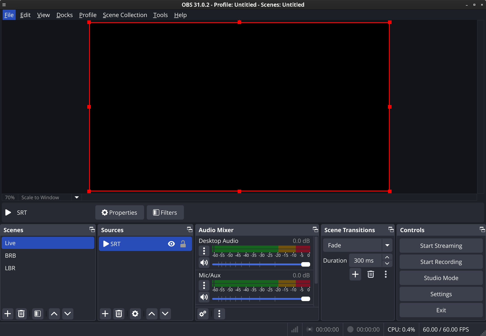

# SRT Middleware
SRT Middleware is
a proxy and scene switcher for SRT and OBS.

What it's not:
- An IRC client taking commands via chat.
- Using encrypted streams.

It
- switches to BRB if no signal,
- switches to LBR if bitrate is below 300kbps
- switches to Live otherwise.

Starting and stopping the stream is done with other tools (OBS Blade etc.)

## Installing

```bash
go install github.com/dlukt/srtmiddleware@latest
mv ~/go/bin/srtmiddleware /usr/local/bin/
```

or

```bash
git clone https://github.com/dlukt/srtmiddleware.git
cd srtmiddleware
go build
mv srtmiddleware /usr/local/bin/
```

## Running
**The proxy MUST be running before starting the monitor.**

### systemd
- copy the service files from the contrib directory
- adjust the command line arguments

## Proxy Arguments
`--from=""` and `--to=""`
must be a SRT URL.
### Examples
```bash
srtmiddleware --from="srt://0.0.0.0:12345?mode=listener" --to="srt://0.0.0.0:23456?mode=listener"
srtmiddleware --from="srt://remote.ip.addr:12345?mode=caller" --to="srt://127.0.0.1:23456?mode=listener"
srtmiddleware --from="srt://0.0.0.0:12345?mode=listener" --to="srt://127.0.0.1:10080?mode=caller"
```
You can also set a `passphrase` parameter if you're using listener mode.
```bash
srtmiddleware --from="srt://0.0.0.0:5555?mode=listener%passphrase=my_secret" --to="srt://127.0.0.1:10080"
```
See also [further SRT options](https://github.com/datarhei/gosrt/blob/main/config.go)
Or the [Haivision document](https://github.com/Haivision/srt/blob/master/docs/apps/srt-live-transmit.md)


`--grpcaddr=""`
default `localhost:50051`
is the address the proxy provides stats at.

## Monitor Arguments
`--grpcaddr=""`
default `127.0.0.1:50051`
is the address to monitor connects to for getting the stats from the proxy.

`--wsaddr=""`
default `localhost:4455`
is the OBS websocket instance the monitor connects to, to manage scenes. 

`--wspass=""`
is the password to use to connect to obs websocket.
Read [how to secure obs websocket](https://blog.icod.de/2025/01/03/secure-obs-websocket-with-nginx/).
It's advised to either use a VPN is connecting from the outside or put it behind nginx for TLS termination, for privacy and security reasons.

`--sceneLive="Live"` `--sceneLBR="LBR"` `--sceneBRB="BRB"`
are the scene names in OBS, they are case sensitive.


## Thank you

To [datarhei](https://github.com/datarhei), who wrote this fantastic go native SRT package.
To Marlow on Discord for the 300kbps Information.