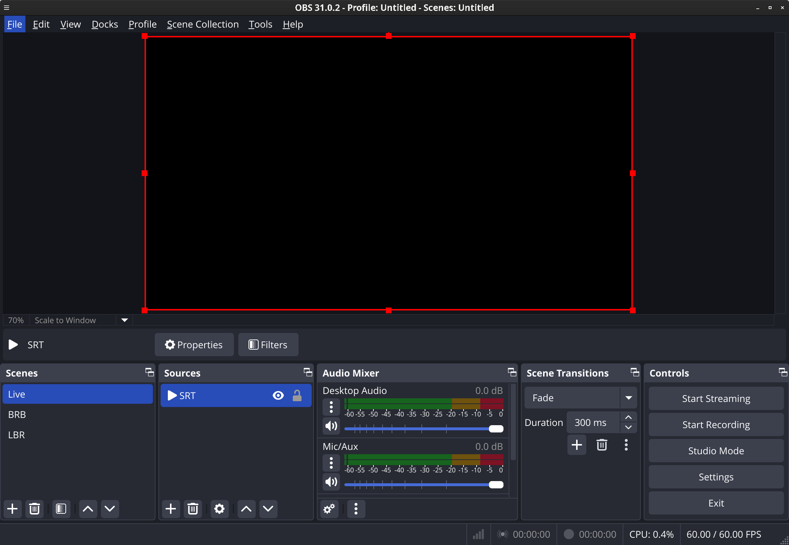

# SRT Middleware
SRT Middleware is
a proxy and scene switcher for SRT and OBS.

What it's not:
- Using encrypted streams.

It
- switches to BRB if no signal,
- switches to LBR if bitrate is below 300kbps
- switches to Live otherwise.
- can optionally listen to Twitch chat via Twitch EventSub WebSockets and switch scenes on authorized `!commands`.

Starting and stopping the stream is done with other tools (OBS Blade etc.)

## Installing

```bash
go install github.com/dlukt/srtmiddleware@latest
mv ~/go/bin/srtmiddleware /usr/local/bin/
```

or

```bash
git clone https://github.com/dlukt/srtmiddleware.git
cd srtmiddleware
go build
mv srtmiddleware /usr/local/bin/
```

or

Download pre-built binaries for your OS/arch from the [GitHub releases page](https://github.com/dlukt/srtmiddleware/releases)
## Running
**The proxy MUST be running before starting the monitor.**

### Monitor config
`monitor` now supports a YAML config file. The default path is `~/.srtmiddleware.yaml`.

Example:

```yaml
monitor:
  grpc_addr: 127.0.0.1:50051
  obs:
    ws_addr: localhost:4455
    ws_pass: ""
  auto_scenes:
    live: Live
    lbr: LBR
    brb: BRB
  twitch:
    enabled: true
    client_id: your-client-id
    client_secret: your-client-secret
    redirect_url: http://127.0.0.1:8099/callback
    listen_addr: 127.0.0.1:8099
    access_token: ""
    refresh_token: ""
    expires_at: ""
    scene_commands:
      "!live": Live
      "!lbr": LBR
      "!brb": BRB
      "!intro": Starting Soon
```

### systemd
- copy the service files from the contrib directory
- adjust the command line arguments

## Proxy Arguments
`--from=""` and `--to=""`
must be a SRT URL.
### Examples
```bash
srtmiddleware --from="srt://0.0.0.0:12345?mode=listener" --to="srt://0.0.0.0:23456?mode=listener"
srtmiddleware --from="srt://remote.ip.addr:12345?mode=caller" --to="srt://127.0.0.1:23456?mode=listener"
srtmiddleware --from="srt://0.0.0.0:12345?mode=listener" --to="srt://127.0.0.1:10080?mode=caller"
```
You can also set a `passphrase` parameter if you're using listener mode.
```bash
srtmiddleware --from="srt://0.0.0.0:5555?mode=listener&passphrase=my_secret" --to="srt://127.0.0.1:10080"
```
See also [further SRT options](https://github.com/datarhei/gosrt/blob/main/config.go)
Or the [Haivision document](https://github.com/Haivision/srt/blob/master/docs/apps/srt-live-transmit.md)


`--grpcaddr=""`
default `localhost:50051`
is the address the proxy provides stats at.

## Monitor Arguments
`--config=""`
defaults to `~/.srtmiddleware.yaml`
and is the primary monitor configuration file.

`--grpcaddr=""`
default `127.0.0.1:50051`
is the address the monitor connects to for getting the stats from the proxy.

`--wsaddr=""`
default `localhost:4455`
is the OBS websocket instance the monitor connects to, to manage scenes. 

`--wspass=""`
is the password to use to connect to obs websocket.
Read [how to secure obs websocket](https://blog.icod.de/2025/01/03/secure-obs-websocket-with-nginx/).
It's advised to either use a VPN is connecting from the outside or put it behind nginx for TLS termination, for privacy and security reasons.

`--sceneLive="Live"` `--sceneLBR="LBR"` `--sceneBRB="BRB"`
are the scene names in OBS, they are case sensitive.


The monitor flags still work and override values from the config file.

## Twitch Chat Control
This uses Twitch chat APIs and EventSub WebSockets, not IRC.

1. Create a Twitch application with a redirect URL that matches your local callback, for example `http://127.0.0.1:8099/callback`.
2. Fill in `monitor.twitch.client_id`, `monitor.twitch.client_secret`, `monitor.twitch.redirect_url`, `monitor.twitch.listen_addr`, and `monitor.twitch.scene_commands` in the config file.
3. Run `srtmiddleware monitor login --config ~/.srtmiddleware.yaml`.
4. Complete the browser login as the broadcaster account.
5. Start the monitor with `srtmiddleware monitor --config ~/.srtmiddleware.yaml`.

Authorized Twitch users:
- the broadcaster
- moderators in that channel

Behavior:
- a configured `!command` switches to the mapped OBS scene and enables manual mode
- while manual mode is active, bitrate-based switching is paused
- `!auto` resumes bitrate-based switching
- the monitor replies in chat after successful or failed actions

Relevant flags:
- `--twitch-enabled`
- `--twitch-client-id`
- `--twitch-client-secret`
- `--twitch-redirect-url`
- `--twitch-listen-addr`
- `--scene-command !intro=Starting Soon`

## Thank you

To [datarhei](https://github.com/datarhei), who wrote this fantastic go native SRT package.
To Marlow on Discord for the 300kbps Information.
